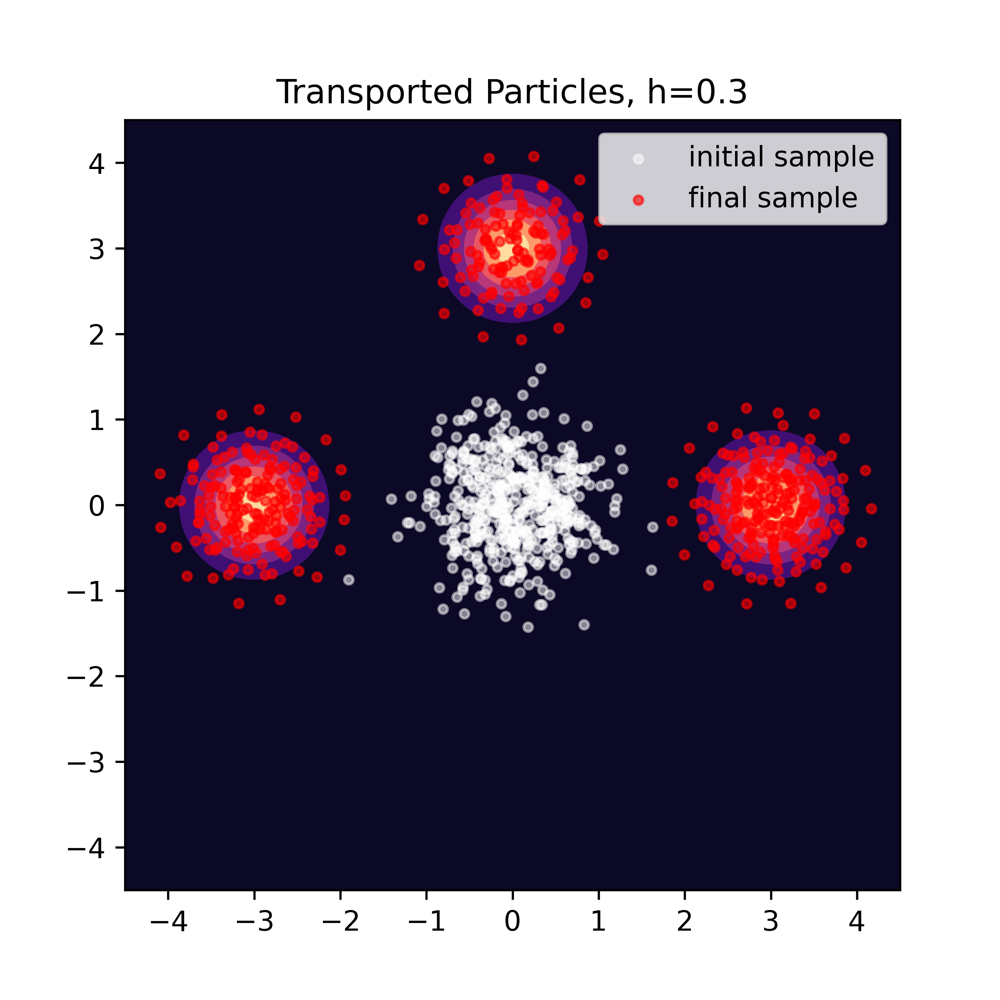
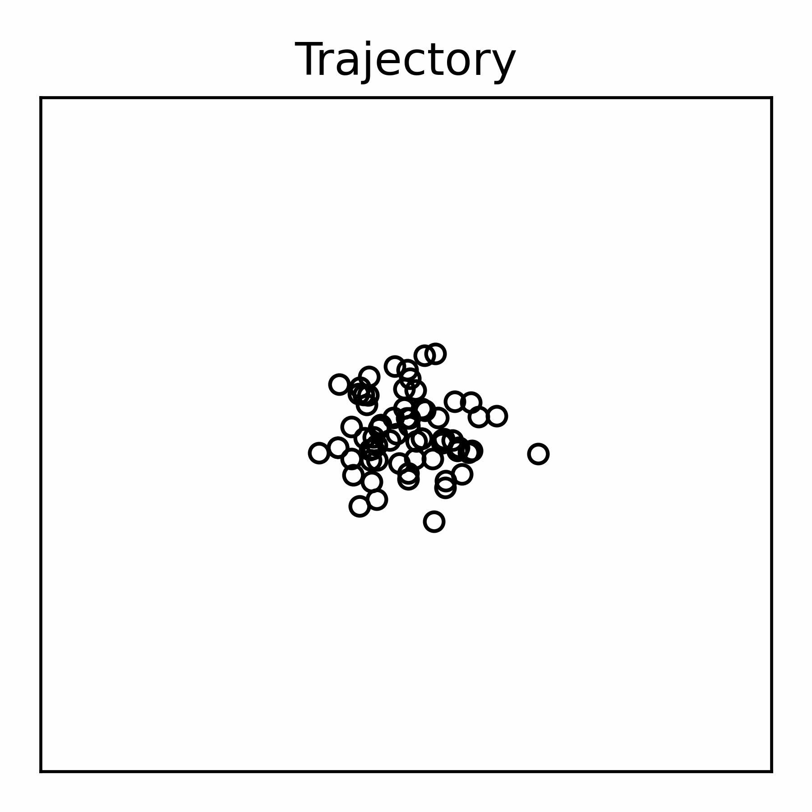

# Re-implementation of Stein Variational Gradient Descent (SVGD)

In this repo, we re-implement the **_Stein Variational Gradient Descent 
(SVGD)_** 
algorithm as the final project for _AMATH 590: Gradient Flows_ course at the 
University of 
Washington taught by taught by [Prof. Bamdad Hosseini](https://bamdadhosseini.org).  The 
authors of this study are 
[@birajpandey](https://github.com/birajpandey) and [@Vilin97](https://github.com/Vilin97). 

SVGD was first developed by Liu et. al. from the Dartmouth ML group. The 
original implementation is linked [here](https://github.com/dilinwang820/Stein-Variational-Gradient-Descent).
> Qiang Liu and Dilin Wang. 
> "Stein Variational Gradient Descent: A General Purpose Bayesian Inference Algorithm".
> [[NeurIPS 2017]](https://proceedings.neurips.cc/paper/2016/file/b3ba8f1bee1238a2f37603d90b58898d-Paper.pdf)


## Final Report
To read our experimental results, please check out the `AMATH_590_SVGD_report.pdf` 
in the repo.

## Setup:

1. Do a clean download of the repository.
   ```
   git clone https://github.com/birajpandey/SVGD-reproducibility.git
   ```
2. Go to the downloaded repo
   ```
   cd path/to/SVGD-reproducibility
   ```
3. Run the `Makefile`. It creates an anaconda environment called `svgd_env`, 
   downloads  required  packages, datasets and runs tests.

   ```
   make 
   ```
3. Activate the conda environment. 

   ```
   conda activate svgd_env
   ```

4. Install the `svgd` package
   ```
   pip install -e .
   ```
   
5. Run the files in `scripts/` to reproduce our results. 

__Remark__: This project structure is based on the 
<a target="_blank" href="https://drivendata.github.io/cookiecutter-data-science/">
cookiecutter data science project template</a>. We also took a great deal of 
help from the <a target="_blank" href="https://goodresearch.dev/#alternative-formats">
The Good Research Code Handbook</a> written by Patrick J Mineault. 

## Example:
Here we use SVGD to sample from a gaussian mixture with three modes.
```python
import os
os.environ["CUDA_VISIBLE_DEVICES"] = '0'
os.environ["XLA_PYTHON_CLIENT_PREALLOCATE"] = 'false'

import jax.numpy as jnp
import jax.random as jrandom
import numpy as np
from svgd import kernel, density, models, plots, config
import matplotlib.pyplot as plt


# Define the gaussian mixture
means = jnp.array([[-3,0], [3,0], [0, 3]])
covariances = jnp.array([[[0.2, 0],[0, 0.2]], [[0.2, 0],[0, 0.2]],
                         [[0.2, 0],[0, 0.2]]])
weights = jnp.array([1 / 3, 1 / 3, 1 / 3])
density_params = {'mean': means, 'covariance': covariances, 'weights': weights}
density_obj = density.Density(density.gaussian_mixture_pdf,
                              density_params)

# initialize the particles
key = jrandom.PRNGKey(10)
particles = jrandom.normal(key=key, shape=(500, 2))  * 0.5

# define model
model_params = {'length_scale': 0.3}
model_kernel = kernel.Kernel(kernel.rbf_kernel, model_params)
transporter = models.SVGDModel(kernel=model_kernel)

# transport
num_iterations, step_size = 1000, 0.5
transported, trajectory = transporter.predict(particles,
                                              density_obj.score,
                                              num_iterations, step_size,
                                              trajectory=True, 
                                              adapt_length_scale=False)
# Plot density
grid_res = 100
# Input locations at which to compute probabilities
x_plot = np.linspace(-4.5, 4.5, grid_res)
x_plot = np.stack(np.meshgrid(x_plot, x_plot), axis=-1)

# Plot density
prob = density_obj(x_plot.reshape(-1, 2)).reshape(grid_res, grid_res)
plt.figure(figsize=(5, 5))
plt.contourf(x_plot[:, :, 0], x_plot[:, :, 1], prob, cmap="magma")

# plot initial particles
plt.scatter(particles[:, 0], particles[:, 1], zorder=2, c="w", s=10,
            label="initial sample", alpha=0.5)

# plot final particles
plt.scatter(transported[:, 0], transported[:, 1], zorder=2, c='r',
            s=10, label="final sample", alpha=0.6)
plt.xlim(-4.5, 4.5)
plt.ylim(-4.5, 4.5)
plt.legend()
plt.title(f"Transported Particles, h={model_params['length_scale']}")
plt.show()
``` 


<p float="left">
  
   
</p>

## Reproducing our experiments

#### 1D benchmarks
To reproduce our experiments for 1D benchmarks, run:
```
python scripts/1.0-bp-svgd-1d.py
```
#### 2D benchmarks

To reproduce our experiments for two-dimensional gaussian mixture, run:
```
python scripts/2.0-bp-three-gaussian.py
```

To reproduce our experiments for two-dimensional circle, run:
```
python scripts/3.0-vi-svgd-circle.py
```